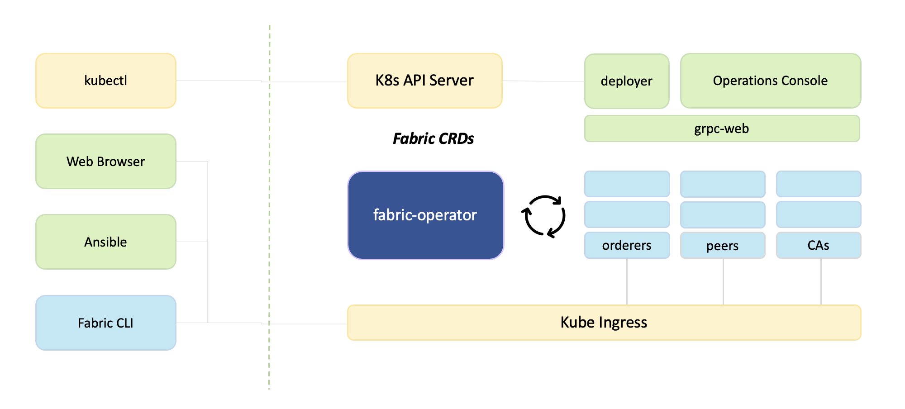

# fabric-operator

**fabric-operator** is an open-source, cloud-native [Operator](https://kubernetes.io/docs/concepts/extend-kubernetes/operator/)
for managing Hyperledger Fabric networks on Kubernetes.  The operator follows the [CNCF Operator Pattern](link),
reducing the minutia of performing repetitive, detailed configuration tasks to automated activities performed under
the guidance of software-based controllers.

Using the operator, a Fabric network is realized in a declarative fashion by applying a series of `CA`, `Peer`, 
`Orderer`, and `Console` resources to the Kubernetes API.  In turn, the controller executes a _reconciliation loop_, 
orchestrating containers, storage, and configuration to achieve the desired target state.

In nautical terms, fabric-operator serves as the _eXecutive Officer / XO_ of a vessel.  It
allows you, the captain, to invest valuable time and energy formulating strategic objectives for a blockchain 
deployment.  The operator, or XO, is responsible to enact the plan, and _"make it so."_ 

_Fabric, Ahoy!_

## Feature Benefits 

- [x] It slices 
- [x] It dices
- [ ] It folds your laundry
- [x] It configures Fabric networks
- [x] It configures Fabric networks on any Kube (even on your laptop)
- [x] It configures Fabric networks with K8s APIs (kubectl, kustomize, helm, SDK clients,...)
- [x] It configures Fabric networks with a web browser
- [x] It configures Fabric networks with Ansible
- [x] It configures Fabric networks with native Fabric CLI binaries
- [x] It configures Fabric networks with CI/CD and git-ops best-practices
- [x] It deploys _Chaincode Now!!!_  (integrated `ccaas` and `k8s` external builders) 
- [x] It detects and automatically re-enrolls TLS certificates 
- [x] It will provide migration and future LTS revision support
- [x] It manages hybrid cloud, multi-org, and multi-cluster Fabric networks
- [x] It runs on pure containerd _and_ mobyd (no dependencies on Docker/DIND)
- [x] It provides wildcard DNS, SNI, and OCP domain ingress routing
- [x] It is battle tested
- [x] It is backed by commercial-grade, enterprise support offerings from IBM
- [x] It ... _just works_.  Enjoy!

## Future Benefits

- [ ] Declarative Fabric resources : `Channel`, `Chaincode`, `Organization`, `Consortium` / MSP, ... CRDs 
- [ ] Service Mesh Overlay (Linkerd, Istio, ...) with mTLS
- [x] Metrics and observability with [Prometheus and Grafana](./docs/prometheus.md)
- [ ] Operational management: Log aggregation, monitoring, alerting
- [ ] Modular CAs (Fabric CA, cert-manager.io, Vault, letsencrypt, ...)
- [ ] Backup / Recovery / Upgrade 
- [ ] Idemixer, Token SDK, BFT Orderer
- [ ] Layer II blockchain integration (Cactus, Weaver, Token SDK, ...)
- [ ] `kubectl`, `fabctl`, `fabric-cli` command-line extensions.

## Build a Fabric Network

- Build a [multi-org](sample-network-multi-org) network on a local KIND development cluster. 
- Build a [sample-network](sample-network) with Kube APIs.
- [Build a Network](https://cloud.ibm.com/docs/blockchain?topic=blockchain-ibp-console-build-network) with the [Fabric Operations Console](https://github.com/hyperledger-labs/fabric-operations-console).
- Automate your network with [Ansible Playbooks](https://cloud.ibm.com/docs/blockchain?topic=blockchain-ansible) and the Console REST APIs.

## Build the Fabric Operator

- How to [compile](docs/DEVELOPING.md#build-the-operator) the operator
- How to [unit test](docs/DEVELOPING.md#unit-tests) the operator
- How to [launch + debug](docs/DEVELOPING.md#debug-the-operator) the operator
- How to [contribute](docs/CONTRIBUTING.md) to this project.

## Community Guidelines 

- This is an open community project.  Be KIND to your peers.
- Focus on **outcomes** (_where are we going_), not **mechanics** (_how will we get there_).
- Discussion, Comments, and Action at Hyperledger Discord : [#fabric-kubernetes](https://discord.gg/hyperledger)

