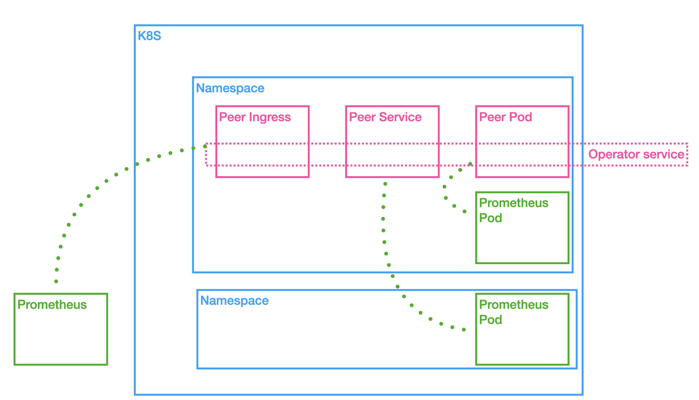

# Integrate Prometheus

## Pre request knowledge
- [Fabric Metric](https://hyperledger-fabric.readthedocs.io/en/release-2.2/metrics_reference.html)
- [Fabric Operations Service](https://hyperledger-fabric.readthedocs.io/en/release-2.2/operations_service.html?highlight=prometheus)

## How to
- Setting for Operator CRDs
The `Operations Service` is enabled by default with prometheus for peer and orderer with fabric operator, if you want to change the config you need to override the default value via configoverride. For example:
```yaml
spec:
  configoverride:
    metrics:
        provider: prometheus
    operations:        
        listenAddress: 0.0.0.0:9443
        tls:
            enabled: true
            key: ${File}
            cert: ${File}
            clientAuthRequired: true
            clientRootCas: ${Files}
```
- Know the network
Pre discussed via [PR here](https://github.com/hyperledger-labs/fabric-operator/pull/38), the reason we use this document as guidance for you to config fabric operator with prometheus is that we can't support all kinds of prometheus deployment/integration case. As [Fabric Operations Service](https://hyperledger-fabric.readthedocs.io/en/release-2.2/operations_service.html?highlight=prometheus), the way prometheus works as fabric peer or orderer enable operation service endpoint and config metric provider in config. Then prometheus should able to connect to peer or orderer to fetch the data. 

- According to your network config prometheus


Hence there are three cases showed as sample above:
- Prometheus with fabric componment in same namespace. In this case, you are able to access pod port if possible.
- Prometheus with fabric componment in different namespace but same k8s cluster. In this case, you are able to access service port if possible.
- Prometheus out of k8s. In this case, you have to access ingress port.