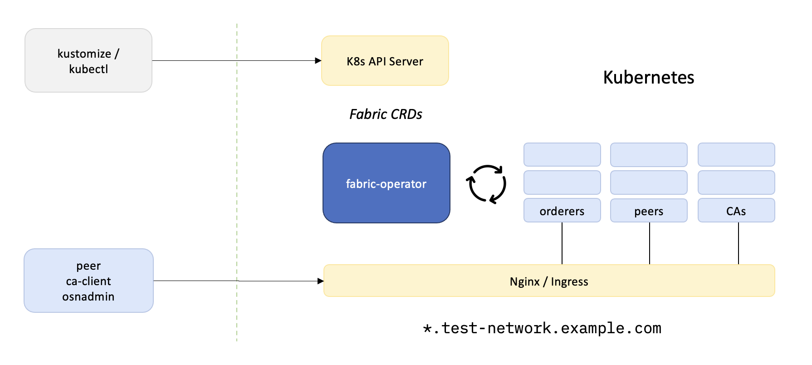

# Sample Network

Create a sample network with CRDs, fabric-operator, and the Kube API server:

- Apply `kustomization` overlays to install the Operator
- Apply `kustomization` overlays to construct a Fabric Network
- Call `peer` CLI and channel participation SDKs to administer the network
- Deploy _Chaincode-as-a-Service_ smart contracts
- Develop _Gateway Client_ applications on a local workstation

Feedback, comments, questions, etc. at Discord : [#fabric-kubernetes](https://discord.gg/hyperledger)



## Prerequisites:

### General

- [kubectl](https://kubernetes.io/docs/tasks/tools/)
- [jq](https://stedolan.github.io/jq/)
- [envsubst](https://www.gnu.org/software/gettext/manual/html_node/envsubst-Invocation.html) (`brew install gettext` on OSX)
- [k9s](https://k9scli.io) (recommended)
- Fabric binaries (peer, osnadmin, etc.) will be installed into the local `bin` folder.  Add these to your PATH:

```shell
export PATH=$PWD:$PWD/bin:$PATH
```


### Kubernetes

If you do not have access to a Kubernetes cluster, create a local instance with [KIND](https://kind.sigs.k8s.io/docs/user/quick-start/#installation)
and [Docker](https://www.docker.com) (+ resources to 8 CPU / 8GRAM):
```shell
network kind
```

For additional cluster options, see the detailed guidelines for:
- [Rancher Desktop](#rancher-desktop): k3s
- [fabric-devenv](#vagrant-fabric-devenv): vagrant VM
- [IKS](#iks)
- [EKS](#eks)
- [OCP](#ocp)


### DNS Domain

The operator utilizes Kubernetes `Ingress` resources to expose Fabric services at a common [DNS wildcard domain](https://en.wikipedia.org/wiki/Wildcard_DNS_record)
(e.g. `*.test-network.example.com`).  For convenience, the sample network includes an Nginx ingress controller,
pre-configured with [ssl-passthrough](https://kubernetes.github.io/ingress-nginx/user-guide/tls/#ssl-passthrough)
for TLS termination at the node endpoints.

For **local clusters**, set the ingress wildcard domain to the host loopback interface (127.0.0.1):
```shell
export TEST_NETWORK_INGRESS_DOMAIN=localho.st
```

For **cloud-based clusters**, set the ingress wildcard domain to the public DNS A record:
```shell
export TEST_NETWORK_INGRESS_DOMAIN=test-network.example.com
```

For additional guidelines on configuring ingress and DNS, see [Considerations for Kubernetes Distributions](https://cloud.ibm.com/docs/blockchain-sw-252?topic=blockchain-sw-252-deploy-k8#console-deploy-k8-considerations).


## Sample Network

Install the Nginx controller and Fabric CRDs:
```shell
network cluster init
```

Launch the operator and `kustomize` a network of [CAs](config/cas), [peers](config/peers), and [orderers](config/orderers):
```shell
network up
```

Explore Kubernetes `Pods`, `Deployments`, `Services`, `Ingress`, etc.:
```shell
kubectl -n test-network get all
```


## Chaincode

In the examples below, the `peer` binary will be used to invoke smart contracts on the org1-peer1 ledger.  Set the CLI context with:
```shell
export FABRIC_CFG_PATH=${PWD}/temp/config
export CORE_PEER_LOCALMSPID=Org1MSP
export CORE_PEER_ADDRESS=test-network-org1-peer1-peer.${TEST_NETWORK_INGRESS_DOMAIN}:443
export CORE_PEER_TLS_ENABLED=true
export CORE_PEER_MSPCONFIGPATH=${PWD}/temp/enrollments/org1/users/org1admin/msp
export CORE_PEER_TLS_ROOTCERT_FILE=${PWD}/temp/channel-msp/peerOrganizations/org1/msp/tlscacerts/tlsca-signcert.pem
```

### Chaincode as a Service

The operator is compatible with sample _Chaincode-as-a-Service_ smart contracts and the `ccaas` external builder.
When using the ccaas builder, the chaincode pods must be [started and running](scripts/chaincode.sh#L183) in the cluster
before the contract can be approved on the channel.

Clone the [fabric-samples](https://github.com/hyperledger/fabric-samples) git repository:
```shell
git clone https://github.com/hyperledger/fabric-samples.git /tmp/fabric-samples
```

Create a channel:
```shell
network channel create
```

Deploy a sample contract:
```shell
network cc deploy   asset-transfer-basic basic_1.0 /tmp/fabric-samples/asset-transfer-basic/chaincode-java

network cc metadata asset-transfer-basic
network cc invoke   asset-transfer-basic '{"Args":["InitLedger"]}'
network cc query    asset-transfer-basic '{"Args":["ReadAsset","asset1"]}' | jq
```

Or use the native `peer` CLI to query the contract installed on org1 / peer1:
```shell
peer chaincode query -n asset-transfer-basic -C mychannel -c '{"Args":["org.hyperledger.fabric:GetMetadata"]}'
```


### K8s Chaincode Builder

The operator can also be configured for use with [fabric-builder-k8s](https://github.com/hyperledgendary/fabric-builder-k8s),
providing smooth and immediate _Chaincode Right Now!_ deployments.  With the `k8s` builder, the peer node will directly
manage the lifecycle of the chaincode pods.

Reconstruct the network with the "k8s-fabric-peer" image:
```shell
network down

export TEST_NETWORK_PEER_IMAGE=ghcr.io/hyperledgendary/k8s-fabric-peer
export TEST_NETWORK_PEER_IMAGE_LABEL=v0.6.0

network up
network channel create
```

Download a "k8s" chaincode package:
```shell
curl -fsSL https://github.com/hyperledgendary/conga-nft-contract/releases/download/v0.1.1/conga-nft-contract-v0.1.1.tgz -o conga-nft-contract-v0.1.1.tgz
```

Install the smart contract:
```shell
peer lifecycle chaincode install conga-nft-contract-v0.1.1.tgz

export PACKAGE_ID=$(peer lifecycle chaincode calculatepackageid conga-nft-contract-v0.1.1.tgz) && echo $PACKAGE_ID

peer lifecycle \
  chaincode approveformyorg \
  --channelID     mychannel \
  --name          conga-nft-contract \
  --version       1 \
  --package-id    ${PACKAGE_ID} \
  --sequence      1 \
  --orderer       test-network-org0-orderersnode1-orderer.${TEST_NETWORK_INGRESS_DOMAIN}:443 \
  --tls --cafile  $PWD/temp/channel-msp/ordererOrganizations/org0/orderers/org0-orderersnode1/tls/signcerts/tls-cert.pem \
  --connTimeout   15s

peer lifecycle \
  chaincode commit \
  --channelID     mychannel \
  --name          conga-nft-contract \
  --version       1 \
  --sequence      1 \
  --orderer       test-network-org0-orderersnode1-orderer.${TEST_NETWORK_INGRESS_DOMAIN}:443 \
  --tls --cafile  $PWD/temp/channel-msp/ordererOrganizations/org0/orderers/org0-orderersnode1/tls/signcerts/tls-cert.pem \
  --connTimeout   15s

```

Inspect chaincode pods:
```shell
kubectl -n test-network describe pods -l app.kubernetes.io/created-by=fabric-builder-k8s
```

Query the smart contract:
```shell
peer chaincode query -n conga-nft-contract -C mychannel -c '{"Args":["org.hyperledger.fabric:GetMetadata"]}'
```


## Teardown

Invariably, something in the recipe above will go awry. Look for additional diagnostics in network-debug.log and
reset the stage with:

```shell
network down
```
or
```shell
network unkind
```


## Appendix: Operations Console

Launch the [Fabric Operations Console](https://github.com/hyperledger-labs/fabric-operations-console):
```shell
network console
```

- open `https://test-network-hlf-console-console.${TEST_NETWORK_INGRESS_DOMAIN}`
- Accept the self-signed TLS certificate
- Log in as `admin:password`
- [Build a network](https://cloud.ibm.com/docs/blockchain?topic=blockchain-ibp-console-build-network)


## Appendix: Alternate k8s Runtimes

### Rancher Desktop

An excellent alternative for local development is the k3s distribution bundled with [Rancher Desktop](https://rancherdesktop.io).

1. Increase cluster resources to 8 CPU / 8GRAM
2. Select mobyd or containerd runtime
3. Disable the Traefik ingress
4. Restart Kubernetes

For use with mobyd / Docker container:
```shell
export TEST_NETWORK_CLUSTER_RUNTIME="k3s"
export TEST_NETWORK_STAGE_DOCKER_IMAGES="false"
export TEST_NETWORK_STORAGE_CLASS="local-path"
```

For use with containerd: 
```shell
export TEST_NETWORK_CLUSTER_RUNTIME="k3s"
export TEST_NETWORK_CONTAINER_CLI="nerdctl"
export TEST_NETWORK_CONTAINER_NAMESPACE="--namespace k8s.io"
export TEST_NETWORK_STAGE_DOCKER_IMAGES="false"
export TEST_NETWORK_STORAGE_CLASS="local-path"
```


### IKS 
For installations at IBM Cloud, use the following configuration settings:

```shell
export TEST_NETWORK_CLUSTER_RUNTIME="k3s"
export TEST_NETWORK_COREDNS_DOMAIN_OVERRIDE="false"
export TEST_NETWORK_STAGE_DOCKER_IMAGES="false"
export TEST_NETWORK_STORAGE_CLASS="ibm-file-gold"
```

To determine the external IP address for the Nginx ingress controller:

1. Run `network cluster init` to create the Nginx resources
2. Determine the IP address for the Nginx EXTERNAL-IP: 
```shell
INGRESS_IPADDR=$(kubectl -n ingress-nginx get svc/ingress-nginx-controller -o json | jq -r .status.loadBalancer.ingress[0].ip)
```
3. Set a virtual host domain resolving `*.EXTERNAL-IP.nip.io` or a public DNS wildcard resolver:
```shell
export TEST_NETWORK_INGRESS_DOMAIN=$(echo $INGRESS_IPADDR | tr -s '.' '-').nip.io
```

For additional guidelines on configuring ingress and DNS, see [Considerations for Kubernetes Distributions](https://cloud.ibm.com/docs/blockchain-sw-252?topic=blockchain-sw-252-deploy-k8#console-deploy-k8-considerations).


### EKS 

For installations at Amazon's Elastic Kubernetes Service, use the following settings:
```shell
export TEST_NETWORK_CLUSTER_RUNTIME="k3s"
export TEST_NETWORK_COREDNS_DOMAIN_OVERRIDE="false"
export TEST_NETWORK_STAGE_DOCKER_IMAGES="false"
export TEST_NETWORK_STORAGE_CLASS="gp2"
```

As an alternative to registering a public DNS domain with Route 54, the [Dead simple wildcard DNS for any IP Address](https://nip.io)
service may be used to associate the Nginx external IP with an `nip.io` domain.

To determine the external IP address for the ingress controller:

1. Run `network cluster init` to create the Nginx resources.
2. Wait for the ingress to come up and the hostname to propagate through public DNS (this will take a few minutes.)
3. Determine the IP address for the Nginx EXTERNAL-IP:
```shell
INGRESS_HOSTNAME=$(kubectl -n ingress-nginx get svc/ingress-nginx-controller -o json  | jq -r .status.loadBalancer.ingress[0].hostname)
INGRESS_IPADDR=$(dig $INGRESS_HOSTNAME +short)
```
4. Set a virtual host domain resolving `*.EXTERNAL-IP.nip.io` to the ingress IP:
```shell
export TEST_NETWORK_INGRESS_DOMAIN=$(echo $INGRESS_IPADDR | tr -s '.' '-').nip.io
```

For additional guidelines on configuring ingress and DNS, see [Considerations for Kubernetes Distributions](https://cloud.ibm.com/docs/blockchain-sw-252?topic=blockchain-sw-252-deploy-k8#console-deploy-k8-considerations).


## Vagrant: fabric-devenv 

The [fabric-devenv](https://github.com/hyperledgendary/fabric-devenv) project will create a local development Virtual
Machine, including all required prerequisites for running a KIND cluster and the sample network.

To work around an issue resolving the kube DNS hostnames in vagrant, override the internal DNS name for Fabric services with:

```shell
export TEST_NETWORK_KUBE_DNS_DOMAIN=test-network
```


## Troubleshooting Tips

- The `network` script prints output and progress to a `network-debug.log` file.  In a second shell:
```shell
tail -f network-debug.log
```

- Tail the operator logging output:
```shell
kubectl -n test-network logs -f deployment/fabric-operator
```


- On OSX, there is a bug in the Golang DNS resolver ([Fabric #3372](https://github.com/hyperledger/fabric/issues/3372) and [Golang #43398](https://github.com/golang/go/issues/43398)),
  causing the Fabric binaries to occasionally stall out when querying DNS.
  This issue can cause `osnadmin` / channel join to time out, throwing an error when joining the channel.
  Fix this by turning a build of [fabric](https://github.com/hyperledger/fabric) binaries and copying the build outputs
  from `fabric/build/bin/*` --> `sample-network/bin`


- Both Fabric and Kubernetes are complex systems.  On occasion, things don't always work as they should, and it's
  impossible to enumerate all failure cases that can come up in the wild.  When something in kube doesn't come up
  correctly, use the [k9s](https://k9scli.io) (or another K8s navigator) to browse deployments, pods, services,
  and logs.  Usually hitting `d` (describe) on a stuck resource in the `test-network` namespace is enough to
  determine the source of the error.
